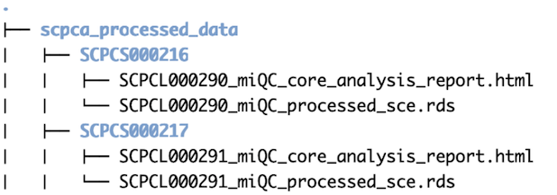

# ScPCA downstream analyses

This repository stores workflows used for performing downstream analyses on quantified single-cell and single-nuclei gene expression data available on the [Single-cell Pediatric Cancer Atlas portal](https://scpca.alexslemonade.org/).
More specifically, the repository currently contains a core workflow that performs initial pre-processing of gene expression data.
Future development will include addition of optional workflows for extended data analyses to be applied to datasets after running the core workflow.

The core workflow takes as input the gene expression data for each library being processed and performs the following steps:

1. [Filtering](./processing-information.md#filtering-low-quality-cells): Each library is filtered to remove any low quality cells.
Here filtering and removal of low quality cells can be performed using [`miQC::filterCells()`](https://rdrr.io/github/greenelab/miQC/man/filterCells.html) or through setting a series of manual thresholds (e.g. minimum number of UMI counts).
In addition to removing low quality cells, genes found in a low percentage of cells in a library are removed.
2. [Normalization](./processing-information.md#normalization) and [dimensionality reduction](./processing-information.md#dimensionality-reduction): Cells are normalized using the [deconvolution method from Lun, Bach, and Marioni (2016)](https://doi.org/10.1186/s13059-016-0947-7) and reduced dimensions are calculated using both principal component analysis (PCA) and uniform manifold approximation and projection (UMAP).
Normalized log counts and embeddings from PCA and UMAP are stored in the `SingleCellExperiment` object returned by the workflow.
3. [Clustering](./processing-information.md#clustering): Cells are assigned to cell clusters using graph-based clustering.
By default, louvain clustering is performed using the [`bluster::NNGraphParam()`](https://rdrr.io/github/LTLA/bluster/man/NNGraphParam-class.html) function using the default nearest neighbors parameter of 10.
Alternatively, walktrap graph-based clustering can be specified, and the number of nearest neighbors parameter can be altered if desired.
Cluster assignments are stored in the `SingleCellExperiment` object returned by the workflow.

To run the core downstream analyses workflow on your own sample data, you will need the following:

1. Single-cell gene expression data stored as `SingleCellExperiment` objects (see more on this in the ["Input data format" section](#input-data-format))
2. A project metadata tab-separated value (TSV) file containing relevant information about your data necessary for processing (see more on this in the ["Metadata file format" section](#metadata-file-format))
3. A mitochondrial gene list that is compatible with your data (see more on this in the ["Running the workflow" section](#running-the-workflow))
4. A local installation of Snakemake and either R or conda (see more on this in the ["how to install the core downstream analyses workflow" section](#how-to-install-the-core-downstream-analyses-workflow))

**Note** that R 4.1 is required for running our pipeline, along with Bioconductor 3.14.
Package dependencies for the analysis workflows in this repository are managed using [`renv`](https://rstudio.github.io/renv/index.html), and `renv` must be installed locally prior to running the workflow.
If you are using conda, dependencies can be installed as [part of the initial setup](#snakemakeconda-installation).

# The core downstream analyses workflow

<!-- START doctoc generated TOC please keep comment here to allow auto update -->
<!-- DON'T EDIT THIS SECTION, INSTEAD RE-RUN doctoc TO UPDATE -->
**Table of Contents**

- [Input data format](#input-data-format)
- [How to install the core downstream analyses workflow](#how-to-install-the-core-downstream-analyses-workflow)
  - [1) Clone the repository](#1-clone-the-repository)
  - [2) Install Snakemake](#2-install-snakemake)
  - [3) Additional dependencies](#3-additional-dependencies)
    - [Snakemake/conda installation](#snakemakeconda-installation)
    - [Independent installation](#independent-installation)
      - [Apple Silicon installations](#apple-silicon-installations)
- [Metadata file format](#metadata-file-format)
- [Running the workflow](#running-the-workflow)
  - [Project-specific parameters](#project-specific-parameters)
  - [Processing parameters](#processing-parameters)
    - [Filtering parameters](#filtering-parameters)
    - [Dimensionality reduction and clustering parameters](#dimensionality-reduction-and-clustering-parameters)
- [Expected output](#expected-output)
- [The optional genes of interest analysis pipeline (In development)](#the-optional-genes-of-interest-analysis-pipeline-in-development)

<!-- END doctoc generated TOC please keep comment here to allow auto update -->

## Input data format

The expected input for our core single-cell downstream analysis pipeline is a [`SingleCellExperiment` object](https://rdrr.io/bioc/SingleCellExperiment/man/SingleCellExperiment.html) that has been stored as a RDS file.
This`SingleCellExperiment` object should contain non-normalized gene expression data with barcodes as the column names and gene identifiers as the row names.
All barcodes included in the `SingleCellExperiment` object should correspond to droplets likely to contain cells and should not contain empty droplets (e.g. droplets with FDR < 0.01 calculated with [`DropletUtils::emptyDropsCellRanger()`](https://rdrr.io/github/MarioniLab/DropletUtils/man/emptyDropsCellRanger.html).
The full path to each individual RDS file should be defined in the project metadata described in the following "How to run the pipeline" section.

The pipeline in this repository is setup to process data available on the [Single-cell Pediatric Cancer Atlas portal](https://scpca.alexslemonade.org/) and output from the [scpca-nf workflow](https://github.com/AlexsLemonade/scpca-nf) where single-cell/single-nuclei gene expression data is mapped and quantified using [alevin-fry](https://alevin-fry.readthedocs.io/en/latest/).
For more information on the this pre-processing, please see the [ScPCA Portal docs](https://scpca.readthedocs.io/en/latest/).
Note however that the input for this pipeline is **not required** to be scpca-nf processed output.

## How to install the core downstream analyses workflow

### 1) Clone the repository

First you will want to clone the [`scpca-downstream-analyses` repository](https://github.com/AlexsLemonade/scpca-downstream-analyses) from GitHub.

You can do this by navigating to the `Code` button at the top of the repository page and copying the URL.
Next, open a local `Terminal` window and use `cd` to navigate to the desired local directory for storing the repository.
We recommend cloning this repository into a separate folder specifically for git repositories.

You can then implement the following command to clone the repository:

`git clone https://github.com/AlexsLemonade/scpca-downstream-analyses.git`

More instructions on cloning a GitHub repository can be found [here](https://docs.github.com/en/repositories/creating-and-managing-repositories/cloning-a-repository).

Once the repository is successfully cloned, a folder named `scpca-downstream-analyses` containing a local copy of the contents of the repository will be created.

### 2) Install Snakemake

The core downstream single-cell analysis pipeline, which includes filtering, normalization, dimensionality reduction, and clustering is implemented using a Snakemake workflow.
Therefore, you will also need to install Snakemake before running the pipeline.

You can install Snakemake by following the [instructions provided in Snakemake's docs](https://snakemake.readthedocs.io/en/v7.3.8/getting_started/installation.html#installation-via-conda-mamba).

As described in the Snakemake instructions, the recommended way to install snakemake is using the conda package manager.
After installing [conda](https://docs.conda.io/projects/conda/en/latest/user-guide/install/index.html) (we recommend the Miniconda installation), you can follow the steps below to set up the bioconda and conda-forge channels and install Snakemake in an isolated environment:

```
conda config --add channels defaults
conda config --add channels bioconda
conda config --add channels conda-forge
conda config --set channel_priority strict

conda install -n base mamba
conda activate base
mamba create -n snakemake snakemake
conda activate snakemake
```

### 3) Additional dependencies

To run the Snakemake workflow, you will need to have R version 4.1 installed, as well as the `renv` package and pandoc.
This can be done independently, or you can use Snakemake's conda integration to set up an R environment that the workflow will use.


#### Snakemake/conda installation

Snakemake can also handle the dependencies by creating its own conda environments, which we have provided as an option.
To create the necessary environment, which includes an isolated version of R, pandoc, and the `renv` package installation, run the following command:

```
snakemake --use-conda --conda-create-envs-only -c1 build_renv
```

If you are on an Apple Silicon (M1/M2/Arm) Mac, you will need a slightly different command, which forces the installation of the Intel version of R, which is required for Bioconductor packages:
```
CONDA_SUBDIR=osx-64 snakemake --use-conda --conda-create-envs-only -c1 build_renv
```

This installation may take up to an hour, as all of the R packages will likely have to be compiled from scratch.
However, this should be a one-time cost, and ensures that you have all of the tools for the workflow installed and ready.

To use the environment you have just created, you will need to run Snakemake with the `--use-conda` flag each time.


#### Independent installation

After confirming that you have R version 4.1 (the Intel version if you are on a Mac) installed, you will want to make sure that all of the R packages are installed as well.
First install the `renv` package by your preferred method.
Then, from within the `scpca-downstream-analyses` directory, run the following command to install all of the additional required packages:

```
Rscript -e "renv::restore()"
```

Note that pandoc must also be installed and in your path to successfully run the `Snakefile`.
You can install pandoc system-wide by following [pandoc's instructions](https://pandoc.org/installing.html), or you can add it to your conda environment with `mamba install pandoc`.

##### Apple Silicon installations

If you are on an Apple Silicon (M1/M2/Arm) Mac and are not using Snakemake and `conda` to handle dependencies, you will need to be sure that you have the Intel version of R, as Bioconductor packages do not currently support the Arm architecture.
Clicking [this link](https://cran.r-project.org/bin/macosx/base/R-4.1.3.pkg) will download the Intel version of R, version 4.1.3, and you can install R following installation instructions.
You will also need to install `gfortan`, a Fortran compiler, to facilitate building certain R packages.
Clicking [this link](https://mac.r-project.org/tools/gfortran-8.2-Mojave.dmg) will download the `gfortran` compiler, and again follow the installation instructions to install it.

If you experience library-related errors that indicate R can't find the Fortran compiler while setting up `renv`, you will want to create the file and/or add the following lines to the file `~/.R/Makevars`:

```
FC  = /usr/local/gfortran/bin/gfortran
F77 = /usr/local/gfortran/bin/gfortran
FLIBS = -L/usr/local/gfortran/lib/gcc
```

These lines will ensure that R can find the newly-installed `gfortran` compiler.
If you need to take these steps, you may need to restart R/terminal to proceed with your setup.


## Metadata file format

Now the environment should be all set to implement the Snakemake workflow.
Before running the workflow, you will need to create a project metadata file as a tab-separated value (TSV) file that contains the relevant data for your input files needed to run the workflow.
The file should contain the following columns:

- `sample_id`, unique ID for each piece of tissue or sample that cells were obtained from,  all libraries that were sampled from the same piece of tissue should have the same `sample_id`.
- `library_id`, unique ID used for each set of cells that has been prepped and sequenced separately.
- `filtering_method`, the specified filtering method which can be one of "manual" or "miQC". For more information on choosing a filtering method, see [Filtering low quality cells](./processing-information.md#filtering-low-quality-cells) in the [processing information documentation](./processing-information.md).
- `filepath`, the full path to the RDS file containing the pre-processed `SingleCellExperiment` object.
Each library ID should have a unique `filepath`.

## Running the workflow

We have provided a [configuration file](https://snakemake.readthedocs.io/en/stable/snakefiles/configuration.html), `config.yaml` which sets the defaults for all parameters needed to run the workflow.

### Project-specific parameters

There are a set of parameters included in the `config.yaml` file that will need to be specified when running the workflow.
These parameters are specific to the project or dataset being processed.
These include the following parameters:

| Parameter        | Description |
|------------------|-------------|
| `results_dir` | relative path to the directory where output files from running the core workflow will be stored |
| `project_metadata` | relative path to your specific project metadata TSV file |
| `mito_file` | full path to a file containing a list of mitochondrial genes specific to the genome or transcriptome version used for alignment. By default, the workflow will use the mitochondrial gene list obtained from Ensembl version 104 which can be found in the `reference-files` directory. |

The above parameters can be modified at the command line by using the [`--config` flag](https://snakemake.readthedocs.io/en/stable/snakefiles/configuration.html).
It is also mandatory to specify the number of CPU cores for snakemake to use by using the [`--cores` flag](https://snakemake.readthedocs.io/en/stable/tutorial/advanced.html?highlight=cores#step-1-specifying-the-number-of-used-threads).
If `--cores` is given without a number, all available cores are used to run the workflow.
The below code is an example of running the Snakemake workflow using the project-specific parameters.

```
snakemake --cores 2 \
  --use-conda \
  --config results_dir="relative path to relevant results directory" \
  project_metadata="relative path to your-project-metadata.TSV" \
  mito_file="full path to your-mito-file.txt"
```

**Note:**  If you did not install dependencies [with conda via snakemake](#snakemakeconda-installation), you will need to remove the `--use-conda` flag.

You can also modify the relevant parameters by manually updating the `config.yaml` file using a text editor of your choice.
The project-specific parameters mentioned above can be found under the [`Project-specific parameters` section](https://github.com/AlexsLemonade/scpca-downstream-analyses/blob/9e82725fe12bcfb6179158aa03e8674f59a9a259/config.yaml#L3) of the config file, while the remaining parameters that can be optionally modified are found under the [`Processing parameters` section](https://github.com/AlexsLemonade/scpca-downstream-analyses/blob/9e82725fe12bcfb6179158aa03e8674f59a9a259/config.yaml#L11).

We have also included example data in the `example-data` directory for testing purposes.
The two example `_filtered.rds` files were both processed using the [`scpca-nf` workflow](https://github.com/AlexsLemonade/scpca-nf/blob/main/examples/README.md).
The `config.yaml` file points to this example data by default.
Therefore, if you would like to test this workflow using the example data, you can run snakemake with just the `--cores` and `--use-conda` flags as in the following example:

```
snakemake --cores 2 --use-conda
```


### Processing parameters

The parameters found under the `Processing parameters` section of the config file can be optionally modified, and are as follows:

#### Filtering parameters

There are two types of filtering methods that can be specified in the project metadata file, [`miQC`](https://bioconductor.org/packages/release/bioc/html/miQC.html) or `manual` filtering.
For more information on choosing a filtering method, see [Filtering low quality cells](./processing-information.md#filtering-low-quality-cells) in the [processing information documentation](./processing-information.md).
Below are the parameters required to run either of the filtering methods.

| Parameter        | Description | Default value |
|------------------|-------------|---------------|
| `seed` | an integer to be used to set a seed for reproducibility when running the workflow | 2021 |
| `prob_compromised_cutoff` | the maximum probability of a cell being compromised as calculated by [miQC](https://bioconductor.org/packages/release/bioc/html/miQC.html), which is required when the `filtering_method` is set to `miQC` in the project metadata | 0.75 |
| `gene_detected_row_cutoff` | the percent of cells a gene must be detected in; genes detected are filtered regardless of the `filtering_method` specified in the project metadata | 5 |
| `gene_means_cutoff` | mean gene expression minimum threshold; mean gene expression is filtered regardless of the `filtering_method` specified in the project metadata | 0.1 |
| `mito_percent_cutoff` | maximum percent mitochondrial reads per cell threshold, which is only required when `filtering_method` is set to `manual` | 20 |
| `detected_gene_cutoff` | minimum number of genes detected per cell, which is only required when `filtering_method` is set to `manual` | 500 |
| `umi_count_cutoff` | minimum unique molecular identifiers (UMI) per cell, which is only required when `filtering_method` is set to `manual` | 500 |

#### Dimensionality reduction and clustering parameters

In the core workflow, PCA and UMAP results are calculated and stored, and the PCA coordinates are used for graph-based clustering.
For more details on how the workflow performs [dimensionality reduction](./processing-information.md#dimensionality-reduction) and [clustering](./processing-information.md#clustering) see the documentation on [workflow processing information](./processing-information.md).
Below are the parameters required to run the dimensionality reduction and clustering steps of the workflow.

| Parameter        | Description | Default value |
|------------------|-------------|---------------|
| `n_genes_pca` | the `n` number of highly variable genes to select as input for PCA| 2000 |
| `cluster_type` | the type of clustering to be performed, values can be "louvain" or "walktrap" (see more on these graph-based clustering methods in this [Community Detection Algorithms article](https://towardsdatascience.com/community-detection-algorithms-9bd8951e7dae)) | "louvain" |
| `nearest_neighbors` | the `n` number of nearest neighbors when performing the chosen graph-based clustering method | 10 |

These parameters can also be modified by manually updating the `config.yaml` file using a text editor of your choice or by supplying the parameters you would like to modify to the `--config` flag as in the following example:

```
snakemake --cores 2 \
  --use-conda \
  --config seed=2021 \
  cluster_type="louvain" \
  nearest_neighbors=10
```

**Note:** For Data Lab staff members working on development, the `project-specific-files` directory holds the files needed if testing with the shared data present on the Rstudio server at `/shared/scpca/gawad_data/scpca_processed_output`.
The directory holds the`aml-config.yaml` file as well as the relevant project metadata file, `aml-library-metadata.tsv`.
To run the workflow using the shared data, use the following command:

```
snakemake --cores 2 \
  --configfile project-specific-files/aml-config.yaml`
```

Also note that new changes should be merged through a pull request to the `development` branch.
Changes will be pushed to the `main` branch once changes are ready for a new release (per the [release checklist document](.github/ISSUE_TEMPLATE/release-checklist.md)).

## Expected output

For each `SingleCellExperiment` and associated `library_id` used as input, the workflow will return two files: a processed `SingleCellExperiment` object containing normalized data and clustering results, and a summary html report detailing the filtering of low quality cells, dimensionality reduction, and clustering that was performed within the workflow.
These files can be found in the `results_dir`, as defined in the `config.yaml` file.
Within the `results_dir`, output files for each library will be nested within folders labeled with the provided `sample_id`.
Each output filename will be prefixed with the associated `library_id` and `filtering_method`.
Below is an example of the nested file structure you can expect.




The `_processed_sce.rds` file is the [RDS file](https://rstudio-education.github.io/hopr/dataio.html#saving-r-files) that contains the final processed `SingleCellExperiment` object (which contains the filtered, normalized data and clustering results).
Clustering results can be found in the [`colData`](https://bioconductor.org/books/3.13/OSCA.intro/the-singlecellexperiment-class.html#handling-metadata) of the `SingleCellExperiment` object, stored in a metadata column named using the associated clustering type and nearest neighbours values.
For example, if using the default values of Louvain clustering with a nearest neighbors parameter of 10, the column name would be `louvain_10` and can be accessed using `colData(sce)$louvain_10`.

The `_core_analysis_report.html` file is the [html file](https://bookdown.org/yihui/rmarkdown/html-document.html#html-document) that contains the summary report of the filtering, dimensionality reduction, and clustering results associated with the processed `SingleCellExperiment` object.

## The optional genes of interest analysis pipeline (In development)

There is an optional genes of interest analysis pipeline in the `optional-goi-analysis` subdirectory of this repository.

To run this analysis, you can run the following command from the main directory:

```
bash optional-goi-analysis/run-provided-goi-analysis.sh \
 --output_dir "path/to/output-results" \
 --sample_name "sample"  \
 --sample_matrix "path/to/sample/matrix" \
 --sample_metadata "path/to/sample/metadata" \
 --goi_list "path/to/goi-list"
```

Where `goi_list` is the path to the genes of interest TSV file relevant to your dataset.
